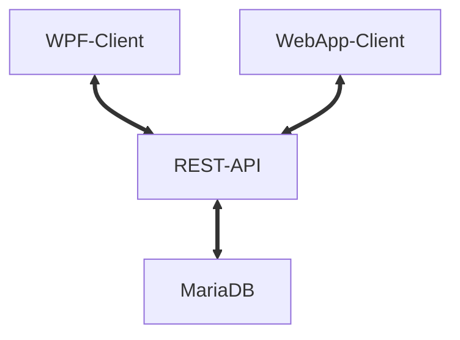
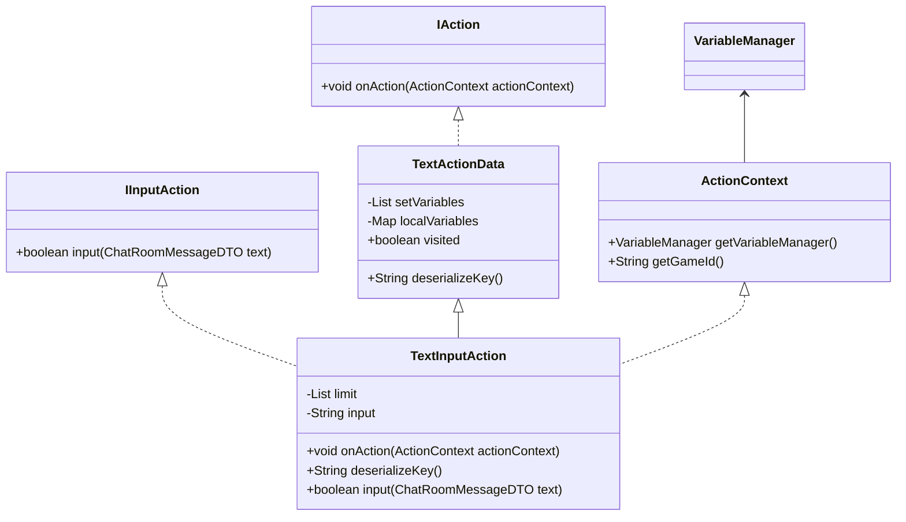
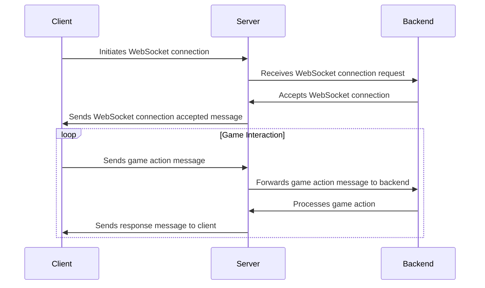

# TextAdventure Project Pollux
***
## Structure

The project 'Pollux' consists of a backend (Spring Boot) and a frontend (WPF & Angular).



### Frontend

#### WPF
As described in the task, a WPF app was made. The WPF and Angular client differs in the target audience. The WPF app is mainly intended for administrational use. Here the maintaince can be carried out and new adventures can be uploaded or disabled. 


#### Angular
Angular has been used as JS-Framework of my choice. It serves the purpose of creating dynamical websites with low amounts of coding lines. Due to the large selection of libraries, dealing with technologies such as Websockets was made pretty simple.

### Backend

#### MariaDB
MariaDB was used in this project to persist and save data. It has been accessed by the frontend through Spring Boot. 

#### Spring Boot
The requests were handled by Spring Boot. Spring Boot offers a wide range of libraries and chosen through previous experience.
***
## Description
### What's the purpose of 'Pollux'
The 'Pollux' software aims to provide users with a platform to create, play, and share text-based adventures.


### Differences between the website and WPF app
While the website tries to offer a seemless playing experience for target audience of gamers, the app tries to reach text adventure creators. Through some intuitive features like uploading and controlling, it enables creating games not only for technicans, but also for less technical people.

***
## Implementation
### Action, Stages & Adventure
An adventure consists of stages which consists of requirements & actions. An action describes what's the next to happen. There are currently 4 types of actions **Input, Output, Timeout & Random-Number**. Only when every requirement defined in the stage applies, it's eligable for being the next one.
Following class diagram explains the input actions' structure. Every action inherit from the abstract base class TextActionData. In order for the deserializer to know how to handle a abstract class, every action has its' own deserializeKey. Based on the deserializedKey it's possible to recognize the original class even when contained in a json string.

***
### Websocket
A websocket in general is a bi-directional connection between a server and one or multiple clients. 

1. **Initiating Connection**: When a player launches the game, their device establishes a websocket connection with the game server.

2. **Bi-Directional Communication**: Once connected, the server and client can exchange messages in both directions, enabling real-time interaction.

3. **Handling Game Actions**: Players can perform various actions in the game, such as making decisions. These actions are sent to the server via websockets for processing.


4. **Input Actions and Response**: In scenarios where the game requires player input, such as making a decision or responding to a prompt, the game pauses and waits for the player's response over the websocket connection. Once received, the game resumes.
***
### How to build your own text adventure
1. First of all, some information like the name of the adventure and the author name is needed. Therefore, there's a so called **Adventure-Header** at the beginning of the json file. 

*Example*: 
```json
{"author": "Gave",  "displayName": "GoT"}
  ```
The header is needed in order to display the informations of the adventure correctly on the website.

2. Here you start with the actual building of your project. You define your stages, where the start stage index **must equal 0**. This is ensures that the backend will know where to start. Every created stage (if it's not a conditional stage) must increase by one, otherwise your adventure will end if no stage is found.

*Example*:
```json
{"author": "Gave",
  "displayName": "GoT",
  "adventure": [
    {
      "id": 0,
      "stage": 0,
      "requirements": [],
      "actions": []
    }]
    } 
```
3. Now you can start creating your actions. You can currently choose between **Input** ("*WAIT_FOR_INPUT*"), **Output**("*WRITE*"), **Timeout** ("*SLEEP*") and **Random-Number**("*RANDOM_NUMBER*") actions (more to follow). Depending on your chosen action there are different fields to set. However, there are some fields which can be used in every action:

- setVariables
    - string, allows local variables to be stored in a global context (only text adventure wise)
- action
    - string, The action property should be assigned to the action type to define the action. 

Fields, only available in some actions: 

**Input**: 
- limit
    - string array, limits the valid input, when a input does not match nothing happens

**Output**:
- text
    - string, text to be given out, allows the use of variables (more to variables later on)

**Timeout**:
- time
    - integer, time to pause until the action gets executed, only client side

**Random-Number**:
- min
    - integer, defines the minimum of a random number(inclusive)
- max
    - integer, defines the upper bond of a random number
    (inclusive)
*Example*:
```json
        {
          "action": "RANDOM_NUMBER",
          "min": 1,
          "max": 2,
          "setVariables": ["randomEvent={random}"]
        }
```
4. Now after you know how to use actions, we move on to create a so-called *conditional stage*. A conditional stage occurs when there are two or more stages with the same stage index, while having different criterias. When a requirement exists, the variable manager searches in the global context for the given variable. If the value of the variable equals the requirements' value, the criteria has been met. Every requirement needs to be applied in order to move on with the next stage. 

*Example*:
```json
{
      "id": 4,
      "stage": 3,
      "requirements": [
        {
          "variable": "wallDecision",
          "value": "überqueren"
        },
        {
          "variable": "randomEvent",
          "value": 2
        }
      ],
      "actions": [
        {
          "action": "WRITE",
          "text": "Eine Lawine erfasst dich. Das Abenteuer endet hier."
        }
      ]
    }
```
5. In order to use variables efficiently, you need a proper understanding of it. As stated above, variables can also be used in your output actions and requirements. Local variables are only available in the current action while global variables can be accessed in any action. Not all actions provide local variables. Following variables do exist in a local context:

- **output action**
    - text
        - the replaced text with resolved variables
- **input action**
    - input
        - the input provided by the user
- **random number action**
    - random
        - the generated number
    
    The *setVariables* property can be used to store the local variable in a global context so you can also access it by requirements and other output actions.

    Only global variables can be used in a output action. The variable needs to be surrounded by two curved braces. Setting a variable via the *setVariable* property differs when you want to set a new variable to a local or global variable. While global variables should also be surrounded by two curved braces, while the local ones only by one.

*Example setting a global variable to the value of a local variable*:
```json
        {
          "action": "WAITING_FOR_INPUT",
          "limit": ["überqueren", "zurück"],
          "setVariables": ["wallDecision={input}"]
        }
```     

*Example setting a global variable to the value of a global variable*:
```json
        {
          "action": "WAITING_FOR_INPUT",
          "limit": ["überqueren", "zurück"],
          "setVariables": ["wallDecision={{random}}"]
        }
```   

*Example using variable in output action*:
```json
        {
          "action": "WRITE",
          "text": "Deine Eingabe {{chosenPath}}"
        }
```
*Example text adventure*:
```json
{
  "author": "Gave",
  "displayName": "GoT",
  "adventure": [
    {
      "id": 0,
      "stage": 0,
      "requirements": [],
      "actions": [
        {
          "action": "WRITE",
          "text": "Willkommen in Westeros! Du befindest dich in den kalten Wäldern des Nordens."
        },
        {
          "action": "SLEEP",
          "time": 2000
        },
        {
          "action": "WRITE",
          "text": "Der Wind trägt das Heulen der Wölfe zu dir herüber."
        },
        {
          "action": "SLEEP",
          "time": 2000
        },
        {
          "action": "WRITE",
          "text": "Vor dir siehst du zwei Wege. Möchtest du den Weg zur Mauer oder den Weg zum Königsmund nehmen? (Antworte mit 'Mauer' oder 'Königsmund')"
        },
        {
          "action": "WAITING_FOR_INPUT",
          "limit": [
            "Mauer",
            "Königsmund"
          ],
          "setVariables": [
            "chosenPath={input}"
          ]
        }
      ]
    },
    {
      "id": 1,
      "stage": 1,
      "requirements": [
        {
          "variable": "chosenPath",
          "value": "Mauer"
        }
      ],
      "actions": [
        {
          "action": "WRITE",
          "text": "Du begibst dich zur Mauer, wo die Nachtwache über das Reich wacht."
        },
        {
          "action": "SLEEP",
          "time": 2000
        },
        {
          "action": "WRITE",
          "text": "Die Luft ist kalt und schneidet wie ein Dolch durch deine Kleidung."
        },
        {
          "action": "SLEEP",
          "time": 2000
        },
        {
          "action": "WRITE",
          "text": "Möchtest du die Mauer überqueren und nach Norden reisen oder zurück in den Norden gehen? (Antworte mit 'überqueren' oder 'zurück')"
        },
        {
          "action": "WAITING_FOR_INPUT",
          "limit": [
            "überqueren",
            "zurück"
          ],
          "setVariables": [
            "wallDecision={input}"
          ]
        }
      ]
    },
    {
      "id": 2,
      "stage": 2,
      "requirements": [
        {
          "variable": "wallDecision",
          "value": "überqueren"
        }
      ],
      "actions": [
        {
          "action": "RANDOM_NUMBER",
          "min": 1,
          "max": 2,
          "setVariables": [
            "randomEvent={random}"
          ]
        },
        {
          "action": "WRITE",
          "text": "Du überquerst die Mauer und triffst auf eine Gruppe Wildlinge."
        },
        {
          "action": "SLEEP",
          "time": 2000
        },
        {
          "action": "WRITE",
          "text": "Generierte Zahl: {{randomEvent}}"
        }
      ]
    },
    {
      "id": 3,
      "stage": 3,
      "requirements": [
        {
          "variable": "wallDecision",
          "value": "überqueren"
        },
        {
          "variable": "randomEvent",
          "value": 1
        }
      ],
      "actions": [
        {
          "action": "WRITE",
          "text": "Nach einem heftigen Kampf überlebst du knapp!"
        }
      ]
    },
    {
      "id": 4,
      "stage": 3,
      "requirements": [
        {
          "variable": "wallDecision",
          "value": "überqueren"
        },
        {
          "variable": "randomEvent",
          "value": 2
        }
      ],
      "actions": [
        {
          "action": "WRITE",
          "text": "Eine Lawine erfasst dich. Das Abenteuer endet hier."
        }
      ]
    }
  ]
}

```
***
### REST-API endpoints


#### AdventureController
  - **@PostMapping**("/newAdventure")
  - **Description**: Uploads a new adventure file.
  - **Request Param**: MultipartFile file
  - **Status Codes**:
    - 201 CREATED - Successfully uploaded the adventure file.
  - **Exceptions**:
    - FileUploadException - If the file upload fails.
    - FileEmptyException - If the uploaded file is empty.
    <br/>    
  - **@GetMapping**("/playAdventure")
  - **Description**: Retrieves the content of a specified adventure file.
  - **Request Param**: String name
  - **Response**: String
  - **Status Codes**:
    - 200 OK - Successfully retrieved the file content.
    - 404 NOT FOUND - If the file is not found.
  - **Exceptions**:
    - GameFileReadException - If there's an error reading the adventure file.
        <br/>
  - **@PostMapping**("/review")
  - **Description**: Submits a review for an adventure.
  - **Request Body**: ReviewDTO
  - **Status Codes**:
    - 202 ACCEPTED - Successfully submitted the review.
  - **Exceptions**:
    - AdventureNotFoundException - If the adventure with the specified ID is not found.
        <br/>

  - **@GetMapping**("/availableGames")
  - **Description**: Retrieves a list of all available games.
  - **Response**: List<GameInfoAvailableDTO>
  - **Status Codes**:
    - 200 OK - Successfully retrieved the list of available games.
        <br/>

#### ChatRoomController
    
  - **@PostMapping**("/newChatroom")
  - **Description**: Creates a new chat room for the game.
  - **Request Body**: CreateGameRoomDTO
  - **Response**: ChatRoomCreatedDTO
  - **Status Codes**:
    - 201 CREATED - Successfully created the chat room.
        <br/>

  - **@GetMapping**("/allChatrooms")
  - **Description**: Retrieves a list of all chat rooms.
  - **Response**: List<GameroomModel>
  - **Status Codes**:
    - 200 OK - Successfully retrieved the list of chat rooms.
        <br/>

#### GameController


 - **@MessageMapping**("/textadventure.send/{gameId}")
 - **Description**: Processes incoming messages for a text adventure game.
 - **Status Codes**:
    - 200 OK - Successfully processed the message.
   

#### Global Exceptions:
**FileUploadException** - For errors during file upload.
**FileEmptyException** - If the uploaded file is empty.
**GameFileReadException** - If there's an error reading the adventure file.
**AdventureNotFoundException** - If the adventure with the specified ID is not found.
**AdventureNotAvailableException** - If the adventure is not available.
   


***
### Roadmap
- [ ] **Improved Exception Handling**: Enhance the error handling mechanism to provide more informative and user-friendly error messages, aiding players in troubleshooting issues encountered during gameplay.

- [ ] **Enhanced Multiplayer**: Implement improvements to the multiplayer functionality, allowing for a more seamless and engaging multiplayer experience. This may include features such as real-time chat, collaborative puzzle-solving, or competitive gameplay modes.

- [ ] **Security Enhancements**: Introduce authentication and authorization mechanisms to improve the security of the application, safeguarding user data and preventing unauthorized access.

- [x] **Content Expansion**: Expand the library of adventures available to players by creating new content.
***

### Update 1.1
Added the option the change how a requirement determines if its fullfilled. The default option is still checking for equivalence. The following options are now available:
- EQUAL
- NOT_EQUAL
- GREATER
- LOWER 
- GREATER_EQUALS
- LOWER_EQUALS

*Example:*

```json
  "requirements": [
    {
      "variable": "wallDecision",
      "value": "überqueren"
      },
      {
        "variable": "randomEvent",
        "value": 10,
        "option" : "GREATER_EQUALS"
      }
  ]
```
In this case, the requirement is met when the randomEvent variable has a value greater or equal 10.

Additionally, it's now possible to use functions. At this point, only a function **ADD** is currently usable. It **has** to be performed in a **setVariables** property.

**Syntax:**
```
$functionName(paramName=paramValue,paramName2={{testVariable}})
```
Currently only Strings and Integers can be used as assignment, other data types are yet to come. Furthermore global variables can be used as an assignment value.

**Example:**
```json
{
  "action": "WRITE",
  "text": "Der Wind trägt das Heulen der Wölfe zu dir herüber.",
  "setVariables": ["$ADD(var=test,add=-5)"]
}
```
***

## Results


### Summary
Overall, the Text Adventure project offers an efficient solution for managing adventures in various scenarios. With an intuitive and user-friendly workspace, the program is easy to navigate. Leveraging modern technologies like WPF, Angular, and Java Spring Boot ensures high flexibility and scalability. 

It's worth noting that no authentication system has been implemented yet in the text adventure project. This may be considered for future iterations to enhance security and user management capabilities. Additionally, while the project allows for multiple players to interact with the same text adventure, there is no true multiplayer functionality. Instead, players can engage in the adventure concurrently, providing answers in real-time, with the first valid response being accepted.
***
## Tech Stack
### Frontend

##### [WPF](https://learn.microsoft.com/en-us/visualstudio/get-started/csharp/tutorial-wpf?view=vs-2022)
##### [C#](https://www.w3schools.com/cs/index.php)
##### [Angular](https://angular.io/)
##### [PrimeNG](https://primeng.org/)

### Backend


##### [Spring Boot](https://start.spring.io/)

### IDE

##### [IntelliJ IDEA 2022.2.5](https://www.jetbrains.com/idea/download/other.html)
##### [Visual Studio Code 1.88.1](https://code.visualstudio.com/download)
##### [Visual Studio 2022 17.9.7](https://visualstudio.microsoft.com/de/)
***