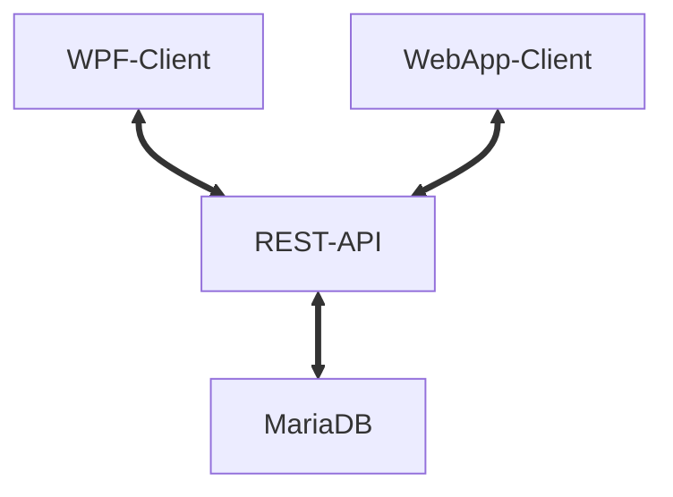
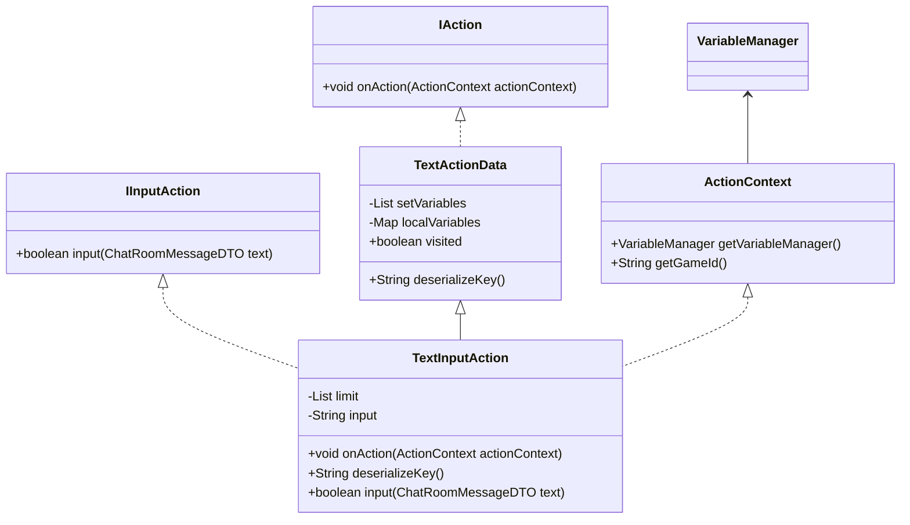
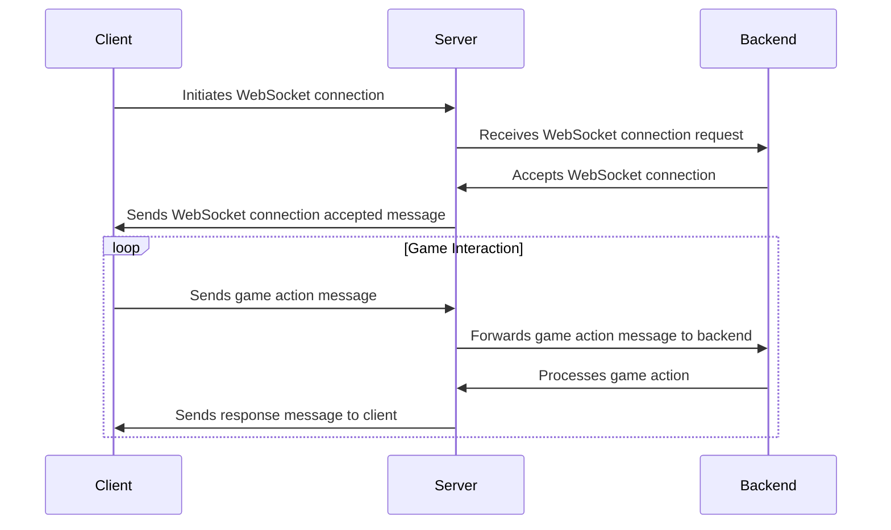

# TextAdventure Project Pollux
***
## Structure

The project 'Pollux' consists of a backend (Spring Boot) and a frontend (WPF & Angular).

### Frontend

#### WPF
As described in the task, a WPF app was made. The WPF and Angular client differs in the target audience. The WPF app is mainly intended for administrational use. Here the maintaince can be carried out and new adventures can be uploaded or disabled. 

#### Angular
Angular has been used as JS-Framework of my choice. It serves the purpose of creating dynamical websites with low amounts of coding lines. Due to the large selection of libraries, dealing with technologies such as Websockets was made pretty simple.

### Backend

#### MariaDB
MariaDB was used in this project to persist and save data. It has been accessed by the frontend through Spring Boot. 

#### Spring Boot
The requests were handled by Spring Boot. Spring Boot offers a wide range of libraries and chosen through previous experience.
***
## Description
### What's the purpose of 'Pollux'
The 'Pollux' software aims to provide users with a platform to create, play, and share text-based adventures.

### Differences between the website and WPF app
While the website tries to offer a seemless playing experience for target audience of gamers, the app tries to reach text adventure creators. Through some intuitive features like uploading and controlling, it enables creating games not only for technicans, but also for less technical people.

***
## Implementation
### Action, Stages & Adventure
An adventure consists of stages which consists of requirements & actions. An action describes what's the next to happen. There are currently 4 types of actions **Input, Output, Timeout & Random-Number**. Only when every requirement defined in the stage applies, it's eligable for being the next one.
Following class diagram explains the input actions' structure. Every action inherit from the abstract base class TextActionData. In order for the deserializer to know how to handle a abstract class, every action has its' own deserializeKey. Based on the deserializedKey it's possible to recognize the original class even when contained in a json string.

***
### Websocket
A websocket in general is a bi-directional connection between a server and one or multiple clients. 

1. **Initiating Connection**: When a player launches the game, their device establishes a websocket connection with the game server.

2. **Bi-Directional Communication**: Once connected, the server and client can exchange messages in both directions, enabling real-time interaction.

3. **Handling Game Actions**: Players can perform various actions in the game, such as making decisions. These actions are sent to the server via websockets for processing.

4. **Input Actions and Response**: In scenarios where the game requires player input, such as making a decision or responding to a prompt, the game pauses and waits for the player's response over the websocket connection. Once received, the game resumes.
***
### Roadmap
- [ ] **Improved Exception Handling**: Enhance the error handling mechanism to provide more informative and user-friendly error messages, aiding players in troubleshooting issues encountered during gameplay.

- [ ] **Enhanced Multiplayer**: Implement improvements to the multiplayer functionality, allowing for a more seamless and engaging multiplayer experience. This may include features such as real-time chat, collaborative puzzle-solving, or competitive gameplay modes.

- [ ] **Security Enhancements**: Introduce authentication and authorization mechanisms to improve the security of the application, safeguarding user data and preventing unauthorized access.

- [ ] **Content Expansion**: Expand the library of adventures available to players by creating new content.
***
## Results

### Summary
Overall, the Text Adventure project offers an efficient solution for managing adventures in various scenarios. With an intuitive and user-friendly workspace, the program is easy to navigate. Leveraging modern technologies like WPF, Angular, and Java Spring Boot ensures high flexibility and scalability. 

It's worth noting that no authentication system has been implemented yet in the text adventure project. This may be considered for future iterations to enhance security and user management capabilities. Additionally, while the project allows for multiple players to interact with the same text adventure, there is no true multiplayer functionality. Instead, players can engage in the adventure concurrently, providing answers in real-time, with the first valid response being accepted.
***
## Tech Stack
### Frontend

##### [WPF](https://learn.microsoft.com/en-us/visualstudio/get-started/csharp/tutorial-wpf?view=vs-2022)
##### [C#](https://www.w3schools.com/cs/index.php)
##### [Angular](https://angular.io/)
##### [PrimeNG](https://primeng.org/)

### Backend

##### [Spring Boot](https://start.spring.io/)

### IDE

##### [IntelliJ IDEA 2022.2.5](https://www.jetbrains.com/idea/download/other.html)
##### [Visual Studio Code 1.88.1](https://code.visualstudio.com/download)
##### [Visual Studio 2022 17.9.7](https://visualstudio.microsoft.com/de/)
***